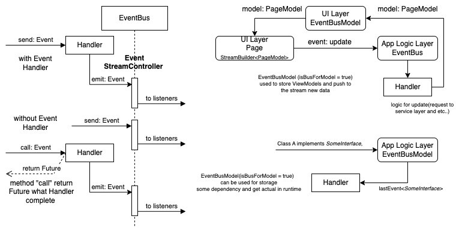

## About
This package is a part of Event-driven architecture providing sending, listening, processing and receiving the events. 
## What new in V2
Now we have two version v1 and v2. In the second version, we have significantly reduced the code base, mode everything easier.  
We added an Event Bus in the Isolate (EventBusIsolate) with which you can also safely exchange events (although remember the limitations when working with isolates).  
Removed the "call" method, now when you send events, you will always get either a result or null after the event handler finishes working. To return the result of the function that caused the events, you need to call the completer(in EventDTO) in event handler or its will be call with null  when handler complety work.   
In V2, we abandoned the EventBusMaster and the need to give names to EventBus. This was done because the approaches to using event buses can be different, someone creates dynamically, someone uses constants, someone uses singleton, etc.

## V2 Simple Usage
EventBus in V2 have 3 main method send, listen and lastData.
```dart
void main() async {
  ///The EventBusIsolate it consists of two EventBus, one on the side of the main isolate and the other in the working isolate.
  /// They exchange EventDTO and the results of the handlers' work among themselves.
  EventBusIsolate isolateBus = EventBusIsolate(onInit: _initIsolate);
  await isolateBus.waitInit;
//listen in in main isolate event from worker isolate
  isolateBus.listen<String>().listen((event) {
    print('event from isolate: $event');
  });
  print('result: ${await isolateBus.send(10)}');
  print('result: ${await isolateBus.send(11)}');
  await Future.delayed(Duration(seconds: 1));
}
//event from isolate: 10
//result: 10
//event from isolate: 11
//result: 11

///this func run in isolate. And we wait event <int> and send result String
void _initIsolate(EventBus bus) {
  ///all EventBus implement EventBusHandlers
  ///and we set handler for event type <int>
  (bus as EventBusHandlers).setHandler<int>(handler: (dto, lastData) async {
    //send result to main thread
    dto.completer?.complete(dto.data.toString());
    //send event<String>
    bus.send(dto.data.toString());
  });
}

```

## V1 Simple Usage 


The event(EventDTO) consists of 3 parts: a header (topic), a unique identifier and data. The topic consists of the type of the transmitted object (required) and the name of the event.  
EventDTO class transporting Event in bus, but user can use clear data without EventDTO for example:
```dart
EventBus bus = EventBus();
//----- Without EventDTO
///listenEvent return Stream
///topic = 'int' 
///bus.listenEvent<int>()! can return null only if you set prefix becouse bus be search other EventBus with prefix in EventBusMaster
bus.listenEvent<int>()!.listen((event)=>print('int event:$event'));
///topic = 'int^test' 
bus.listenEvent<int>(eventName:'test')!.listen((event)=>print('int^test event:$event'));
///topic = 'int' 
bus.send<int>(1); //'int event:1'
bus.send(2); //'int event:2' in this case type event get automated
///topic = 'int^test' 
bus.send<int>(3,eventName:'test');////'int@test event:3'
//----- With EventDTO
bus
      .listenEventDTO<int>()!
      .listen((event) => print('topic ${event.topic} uuid:${event.uuid} event:${event.data}'));
bus
      .listenEventDTO<int>(eventName: 'test')!
      .listen((event) => print('topic ${event.topic} uuid:${event.uuid} event:${event.data}'));
```
When you call listenEvent method, you can set flag repeatLastEvent what send event after wait 1 millisecond or [Duration] 
## V1 Used with prefix and EventBusMaster
EventBusMaster is a singltone what have knowledg about all created EventBus and use prefix to sort them.
The Event Bus Master also provides the ability to send and receive events from different business, but if there is no bus, it will return null or false. If you use any bus to send by prefix and the bus prefix does not match the specified prefix, event will be send to EventBusMaster.
```dart
EventBus bus = EventBus();
EventBus busServices = EventBus(prefix: 'services');
/// get event from bus
EventBusMaster.instance.listenEvent<int>()!.listen((event) => print('int master event:$event'));
/// get event from busServices
EventBusMaster.instance
      .listenEvent<int>(prefix: 'services')!
      .listen((event) => print('int master services bus event:$event'));
  bus.send<int>(5);
  EventBusMaster.instance.send(6);
  EventBusMaster.instance.send(7, prefix: 'services');
```
The prefix can be used to divide the application into layers, for example:
ViewModel - layers for stores the latest state of the models and does not delete unused nodes (more on this later).  
App - layer in which the business logic.  
AppModel the layer, like ViewModel , stores the latest data models necessary for the operation of the application.  
Services and ServicesModel , respectively.  

## V1 EventBus for Model
By default EventBus, clear not use(where event listeners ==0) event node, but if you add flag 'isBusForModel' in constructor, you get EventBus(EventModelController) what not clear event node.
This EventModelController can be used by hold(resource manager) and update object(models, providers, command, interface and other).  

## V1 EventBus Handler
EventBusHandlersGroup this interface for handler group. You can connect  EventBusHandlersGroup to you event bus
```dart
///Event handler
typedef EventHandler<T> = Future<void> Function(
    EventDTO<T> event,

    ///send event to other listener
    EventEmitter<EventDTO<T>>? emit,
    {EventBus? bus,
    Completer<dynamic>? needComplete});


class TestHandlers implements EventBusHandlersGroup {
void connect(EventBusHandler bus) {
///if you have many void handler need use eventName
bus.addHandler<void>(getMasterData, eventName: 'getMasterData');
///if handle unique for object you can not set eventName
bus.addHandler<Test>(test);
}
...
void main()
{
  EventBus bus = EventBus(prefix: 'test');
  var handlers = TestHandlers();
  handlers.connect(bus);
  bus.send<void>(null,eventName:'getMasterData');//call getMasterData fn
  bus.send(Test());//call test fn
}
```

## V1 Method: Call 
If event have handler, handler can processing **needCompleter** and complety it. Result of complety return from future.  
if event no have handler or handler dont support **needCompleter** Future complete with Error
```dart
//wait result or error
try{
var r = await bus1.call('Hello');
}
catch (e)
{
      print(e);
}
```


